# Electric & Laser Shading

What each electric and laser key does, with pictures. Picking systems, switches and Options.ini
settings are on [Direct3D 9 Features](dx9feat.md#electric-shading).

All keys go in the mod's `GameData.ini`. Cheat builds reload them about half a second after the file
is saved, except the `ElectricParticleTextures` and `LaserParticleTextures` lists, which are read at
launch.

A `W3DLaserDraw` module can also set any electric or laser tuning key. The value it sets overrides
`GameData.ini` for that beam alone. `ElectricShader = Yes` on the module shades the beam as
electricity instead of as a laser.

The pictures run the game's shader math offline, on a stand-in flare and beam texture, at the scale
the default camera sees them. Arc shapes, strengths and colours match the game. The textures are
not Contra's own.

## Electric shading

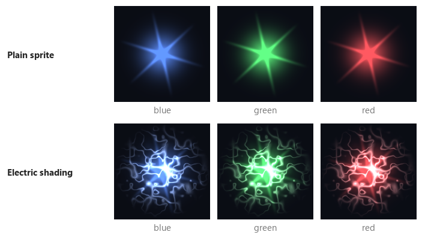

Arcs take the sprite's own colour halfway to white, so blue, green and red effects keep their hue.

### Arcs

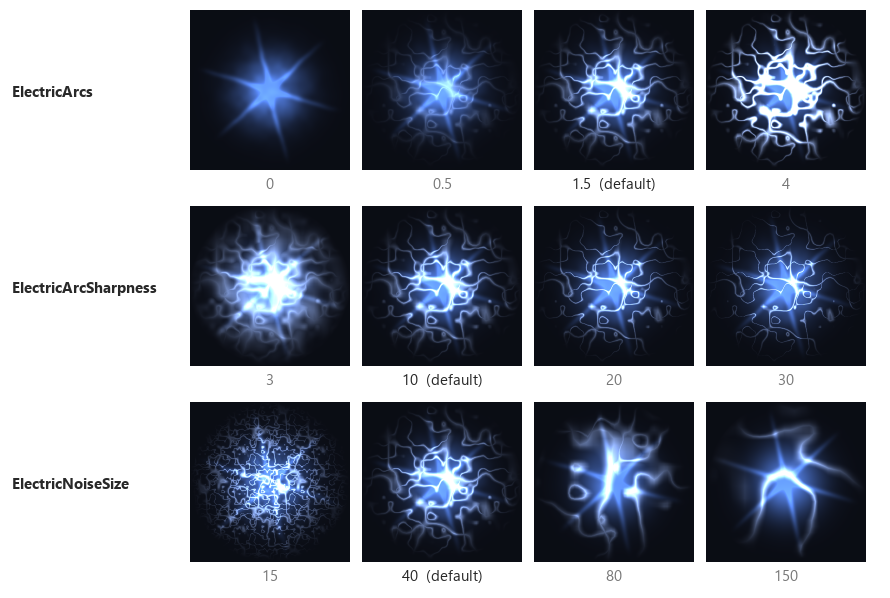

* `ElectricArcs = 1.5` - (Arc brightness. 0 turns the arcs off, leaving jitter and flicker. Past 4
the arcs wash the sprite white.)
* `ElectricArcSharpness = 10` - (Arc thickness. Low values give broad glowing bands, high values thin
threads. Past 30 threads break into dots.)
* `ElectricNoiseSize = 40` - (World units across one tile of arc noise. Smaller gives more, closer
arcs. It is measured in the world, not per sprite, so a big effect carries more arcs than a small
spark.)

### Jitter and flicker

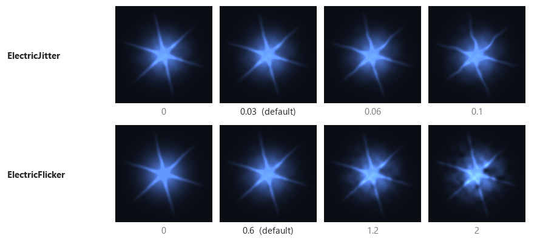

* `ElectricJitter = 0.03` - (How far the texture jumps each crackle, in texture widths. It bends the
flare's rays and edges.)
* `ElectricFlicker = 0.6` - (How far brightness swings, as a fraction. It varies across the sprite
and from crackle to crackle. Past 2 the dim patches go black.)

### Crackle rate

Each crackle moves the noise to a fresh spot, so arcs, jitter and flicker all change at once.

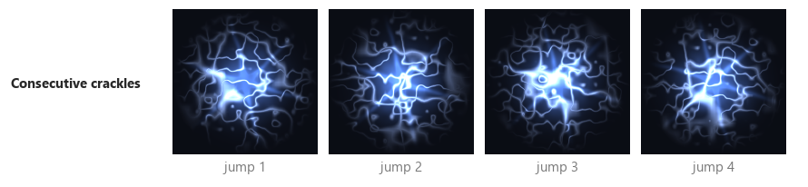

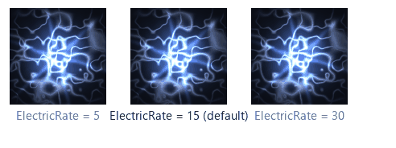

* `ElectricRate = 15` - (Crackles per second. 0 freezes the arcs in place. Above the frame rate
every frame crackles, so higher values look the same.)

### Distance

The pitched camera sees the top of the screen from much further away than the bottom, and zooming
out moves everything further still. Past the default camera's distance, `CameraHeight` over the
sine of `CameraPitch`, arcs widen with distance so they stay at least a pixel or two wide. Without
that they would thin to broken, shimmering dots.

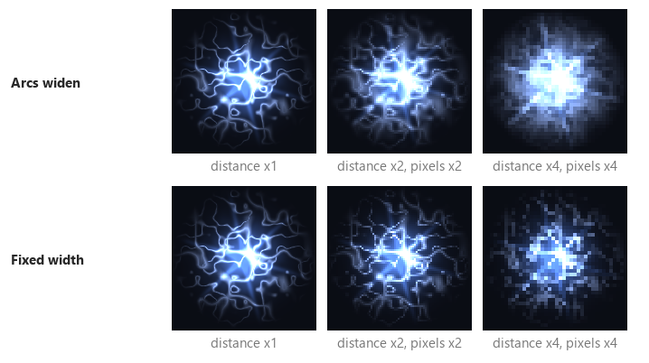

There is no key for this. It follows `CameraHeight` and `CameraPitch`.

## Laser shading

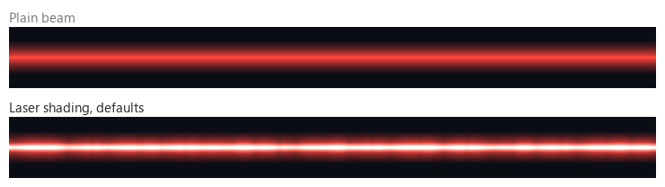

The beam's own texture still gives its colour and shape. The shader adds the white-hot core, the
pulses and the soft edges.

### Core

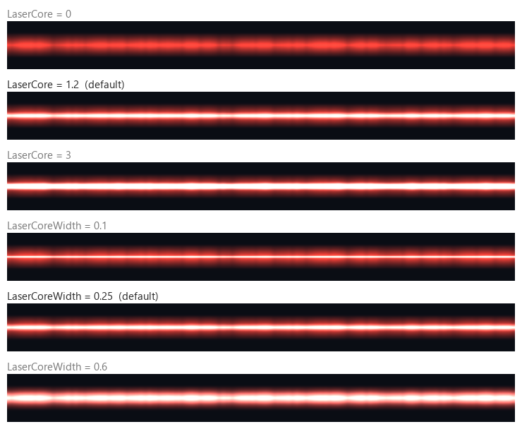

* `LaserCore = 1.2` - (Core brightness. 0 turns the core off.)
* `LaserCoreWidth = 0.25` - (Core width, as a fraction of the beam's half width.)

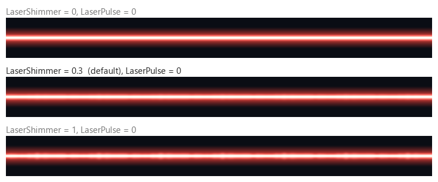

* `LaserShimmer = 0.3` - (How far the core's width wavers along the beam, as a fraction. 0 keeps it
steady, 1 at most.)

### Pulses

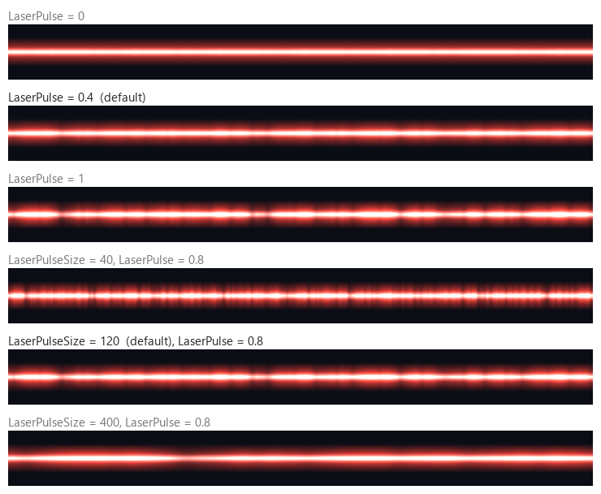

* `LaserPulse = 0.4` - (How far brightness swings along the beam, as a fraction. 0 is steady.)
* `LaserPulseSize = 120` - (World units across one tile of pulse noise. Smaller gives more, shorter
pulses.)

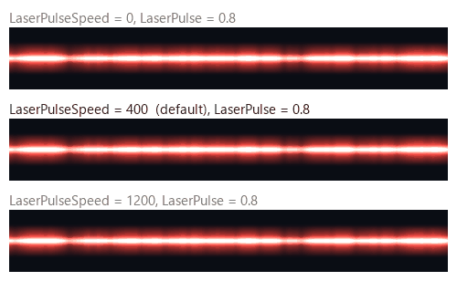

* `LaserPulseSpeed = 400` - (World units a second the pulses travel towards the target. 0 freezes
them. Pulses are fixed along the beam, so they keep flowing smoothly while the shooter moves.)

## Laser ground glow

Each beam lights the ground with one light shaped like the beam. The ground takes the light at its
distance from the nearest point on the beam, measured in three dimensions. Pictures are seen from
above, with the beam drawn as a white line.

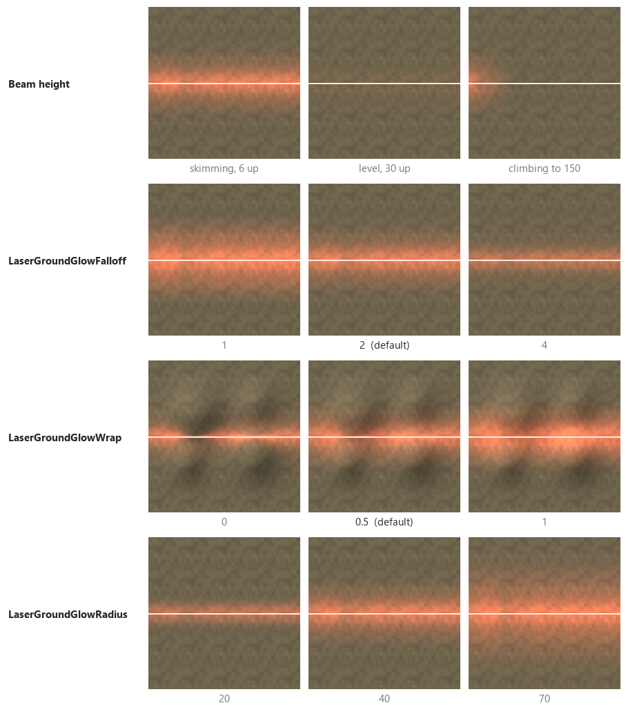

* Beam height - (A beam skimming the ground lights a bright strip. A level beam high above the
ground lights little. A beam climbing into the sky lights only the ground near the shooter.)
* `LaserGroundGlowFalloff = 2` - (How fast the light fades with distance from the beam, as a power.
Higher gives a tight bright core, lower a broad wash.)
* `LaserGroundGlowWrap = 0.5` - (Light on ground facing away from the beam, from 0 to 1. 0 lights
only slopes facing it, so hills show dark backs. 1 lights all ground evenly.)
* `LaserGroundGlowRadius = 0` - (How far the light reaches from the beam, in world units. 0 takes
1.25 times the laser's `OuterBeamWidth`, at least 15. `GroundGlowRadius` on the `W3DLaserDraw`
module overrides it for one laser.)

The glow's colour and strength come from `LaserGroundGlowColor` and `LaserGroundGlowIntensity`,
described under [Laser ground glow](contraZH-Changes.md#laser-ground-glow).

## Tuner

`scripts/fx_tuner.py` opens a window with a slider for every key on this page and a live, animated
preview beside them. It needs Python with numpy, Pillow and PyQt5.

```
python scripts/fx_tuner.py
```

* It loads the keys from the game's `GameData.ini` at start. The path is at the top of the window.
* `Save to GameData.ini` writes the slider values in place, keeping each line's comment, and adds
keys the file lacks. It backs the file up once per session. Cheat builds pick the change up within
a second, so the game shows it with a map running.
* `Copy lines` puts the keys on the clipboard instead.
* Preview-only controls set the sprite size, camera distance, colours and beam height. `Texture...`
loads an extracted `.tga` or `.dds` in place of the stand-in flare or beam.
* `python scripts/fx_tuner.py --docs` redraws every picture on this page into `docs/images`.
