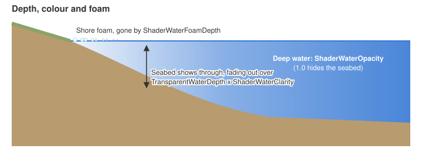
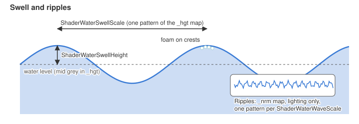
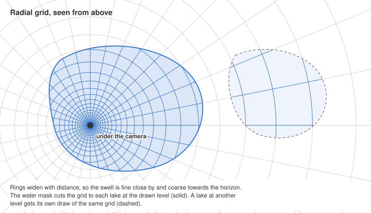
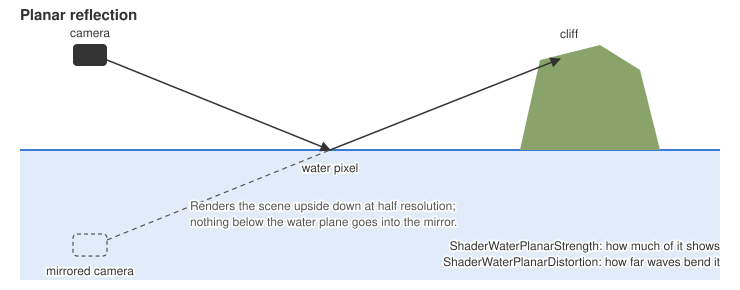

# Water

Lakes, seas and rivers are shaded per pixel. The seabed ripples through the waves and fades into
the water colour with depth, the surface mirrors the cliffs, trees, units and buildings around it
against the map's skybox, the sun glints off the waves, and foam gathers along the shore and on swell
crests. Unit, building and cliff shadows darken the water when shadow mapping is on. Needs the
Direct3D 9 build and shader model 2.0a; other cards get the old water.

# Options.ini

* `ShowSoftWaterEdge = Yes` - (`Smooth water` in the options menu. On picks shader water, off the
old flat water.)
* `WaterReflections = Yes` - (`Water reflections` in the options menu, applied on Accept. No keeps
only the skybox in the water. The mirror draws the scene a second time at half resolution. Needs
`CheckWaterReflections` in `OptionsMenu.wnd` for the menu control.)

# Water.ini

The water colour and texture still come from `StandingWaterColor`, `StandingWaterTexture` and the
time of day `DiffuseColor`. Tuned in the `WaterTransparency` block of `Water.ini`, and per map in
`map.ini`.

Cheat builds reload `Data\INI\Water.ini` about half a second after it is saved, so the water can be
tuned with a map running. The saved values win over the map's `map.ini` until the map loads again.
A deleted key keeps its value until a restart, skybox textures need a restart, and a file with an
error is skipped until the next save.

## Depth and colour

* `TransparentWaterDepth = 3.0` - (Depth over which the seabed fades out, and over which the
reflection, glint and foam fade in from the shoreline, so the water meets the ground without a
line. 0 gives a hard shore edge. Same key as the old water.)
* `TransparentWaterMinOpacity = 1.0` - (Opacity of deep water. Same key as the old water.)
* `ShaderWaterOpacity = 0.95` - (Opacity of deep water, replacing `TransparentWaterMinOpacity` for shader
water. 0 uses `TransparentWaterMinOpacity` instead.)
* `ShaderWaterClarity = 1.0` - (Scales `TransparentWaterDepth`. Higher sees deeper.)
* `ShaderWaterFoamDepth = 6` - (Depth where shore foam fades out. 0 turns foam off.)

## Surface

These keys control the ripples, the sun glint and how far the waves bend the seabed. The inset in
the swell picture below shows the ripple pattern.

* `ShaderWaterReflection = 3.0` - (Scales the sky reflection. 0 turns it off.)
* `ShaderWaterSpecular = 1.0` - (Scales the sun glint. 0 turns it off.)
* `ShaderWaterRefraction = 0.015` - (How far the waves bend the seabed, as a fraction of the screen.)
* `ShaderWaterWaveScale = 160` - (World units one wave pattern covers. Higher gives broader waves.)
* `ShaderWaterWaveStrength = 0.3` - (Steepness of the waves. Drives glint, reflection and bending.)

## Animation

* `WaterAnimationFps = 0` - (Moves the water as if the game ran at this rate, 30 to 60. Without it
the water speeds up with the frame rate when the game logic is uncapped. 30 gives the original
speed. 0 moves the water every frame.)

## Swell

* `ShaderWaterSwellHeight = 3.0` - (Height of the vertex waves that lift lakes and seas, in world
units. 0 turns them off. Needs a shader model 3 card.)
* `ShaderWaterSwellScale = 700` - (World units one swell pattern covers. Higher gives longer swells.)
* `ShaderWaterSwellSpeed = 30` - (World units a second the swell drifts. 0 holds it still.)

The swell rides nested square grids centred under the camera, each with cells twice the size of
the one inside it, so it is fine close by and coarser towards the horizon. Each grid snaps to its
own world lattice, so moving the camera never makes the waves shift or shimmer. The grids cover
every flat lake and sea at a level, cut to their outlines per map cell and one cell wider, so the
cut falls on dry land and the shore fades as drawn. Standing water whose points differ in height by
more than a unit keeps its own grid, and rivers stay flat.

## Reflection

* `ShaderWaterPlanarStrength = 0.3` - (Reflection the mirrored scene adds on top of the sky's. 0
leaves the mirror only at grazing angles.)
* `ShaderWaterPlanarDistortion = 0.02` - (How far the waves bend the mirrored scene, as a fraction of
the screen.)
* `ShaderWaterPlanarFade = 4` - (Water at another height than the one under the view fades from the
mirror to the skybox over this many world units.)

# Key reference

Every key `Water.ini` accepts, with its format, default and useful values. Colours are written
`R:0-255 G:0-255 B:0-255`, with ` A:0-255` added for RGBA. Booleans are `Yes` or `No`. Textures are
file names in `Art\Textures`.

The game enforces only the limits marked **(hard)**, clamping values past them. The other ranges
are where the water still looks right; values outside them load, but the look breaks down.

## WaterTransparency

One block. `map.ini` can override any of these keys for its map.

| Key | Format | Default | Range | Values |
|---|---|---|---|---|
| `TransparentWaterDepth` | number | `3.0` | `0` - `50` | Depth over which the seabed fades out and the surface fades in from the shore. `0` gives a hard shore edge. |
| `TransparentWaterMinOpacity` | number | `1.0` | `0` - `1` | Opacity of deep water for the old water, and for shader water when `ShaderWaterOpacity` is `0`. Above `1` over-brightens. |
| `StandingWaterColor` | RGB | `R:255 G:255 B:255` | `0` - `255` each **(hard)** | White tints lakes and rivers by the map's light times the `WaterSet` `DiffuseColor`. Black draws them unlit. Any other colour is used as the tint. |
| `StandingWaterTexture` | texture | `TWWater01.tga` | - | Surface texture of lakes, seas and rivers. Its `_nrm.dds` and `_hgt.dds` follow its name. |
| `AdditiveBlending` | Yes/No | `No` | - | `Yes` adds the water onto the scene and keeps the old water, with no shader water. |
| `RadarWaterColor` | RGB | `R:140 G:140 B:255` | `0` - `255` each **(hard)** | Colour of water on the radar. |
| `SkyboxTextureN` | texture | `TSMorningN.tga` | - | North face of the skybox, which shader water reflects. Also `SkyboxTextureE`, `S`, `W` and `T` (top), defaulting to `TSMorningE.tga` and so on. |
| `ShaderWaterOpacity` | number | `0.95` | `0` - `1` | Opacity of deep water. `0` uses `TransparentWaterMinOpacity`. Above `1` over-brightens. |
| `ShaderWaterClarity` | number | `1.0` | `0.1` - `10` | Scales `TransparentWaterDepth` for how deep the seabed shows. |
| `ShaderWaterReflection` | number | `3.0` | `0` - `10` | `0` turns the sky reflection off. Reflection is capped at 80% **(hard)**, so higher values only spread that cap to steeper views. |
| `ShaderWaterSpecular` | number | `1.0` | `0` - `5` | `0` turns the sun glint off. Above `5` the glint washes out to white. |
| `ShaderWaterRefraction` | number | `0.015` | `0` - `0.1` | Fraction of the screen the waves bend the seabed by. `0` turns it off. Above `0.05` smears. |
| `ShaderWaterWaveScale` | number | `160` | `1` **(hard)** - `2000` | World units one ripple pattern covers. Below `50` the ripples shimmer, above `2000` they are too broad to see. |
| `ShaderWaterWaveStrength` | number | `0.3` | `0` - `2` | Ripple steepness. `0` is flat. Above `2` the surface turns to glitter. |
| `ShaderWaterFoamDepth` | number | `6` | `0` - `30` | Depth where shore foam fades out. `0` turns foam off. |
| `ShaderWaterSwellHeight` | number | `3.0` | `0` - `10` | Height of the vertex waves in world units. `0` turns them off. Above `10` the waves cut into shores and hulls. |
| `ShaderWaterSwellScale` | number | `700` | `1` **(hard)** - `3000` | World units one swell pattern covers. Below `200` the swell looks choppy, above `3000` it is too broad to see. |
| `ShaderWaterSwellSpeed` | number | `30` | `-200` - `200` | World units a second the swell drifts. `0` holds it still. Negative reverses it. |
| `ShaderWaterPlanarStrength` | number | `0.3` | `0` - `1` | Reflection the mirrored scene adds on top of the sky's. The 80% cap applies to the sum. |
| `ShaderWaterPlanarDistortion` | number | `0.02` | `0` - `0.1` | Fraction of the screen the waves bend the mirrored scene by. `0` keeps it sharp. |
| `ShaderWaterPlanarFade` | number | `4` | `0.01` **(hard)** - `50` | World units over which water at another height fades from the mirror to the skybox. |
| `WaterAnimationFps` | whole number | `0` | `0`, or `30` - `60` **(hard)** | Moves the water as if the game ran at that rate. `0` moves it every frame. Values from `1` to `29` count as `30`, and above `60` as `60`. |

## WaterSet

One block per time of day: `WaterSet MORNING`, `AFTERNOON`, `EVENING` and `NIGHT`. Only
`DiffuseColor` touches the lakes, seas and rivers above. The rest drive the old mirrored water
types and the animated water grid, which shader water does not use.

| Key | Format | Default | Range | Values |
|---|---|---|---|---|
| `DiffuseColor` | RGBA | `R:0 G:0 B:0 A:0` | `0` - `255` each **(hard)** | Tint of lakes and rivers when `StandingWaterColor` is white. Alpha is the old water's opacity. |
| `TransparentDiffuseColor` | RGBA | `R:0 G:0 B:0 A:0` | `0` - `255` each **(hard)** | Colour and alpha of the old pixel shader sea. |
| `SkyTexture` | texture | none | - | Sky plane the old mirrored water reflects. |
| `SkyTexelsPerUnit` | number | `0` | `0.1` - `10` | Sky texture texels per world unit. Higher repeats the texture more. |
| `UScrollPerMS` | number | `0` | `-0.1` - `0.1` | Sky plane drift along one axis, in world units a millisecond. |
| `VScrollPerMS` | number | `0` | `-0.1` - `0.1` | Sky plane drift along the other axis, in world units a millisecond. |
| `Vertex00Color` | RGBA | `R:0 G:0 B:0 A:0` | `0` - `255` each **(hard)** | Colour at one corner of the sky plane. Also `Vertex01Color`, `Vertex10Color` and `Vertex11Color` for the other three. |
| `WaterTexture` | texture | none | - | Texture of the animated water grid. |
| `WaterRepeatCount` | whole number | `0` | `1` - `100` | Times `WaterTexture` repeats across the water grid. |

# Textures

Both sit beside the water texture in `Art\Textures` itself, not in a subfolder.

* `TWWater01_nrm.dds` for `TWWater01.tga` - (Normal map that replaces the built-in waves, named like
unit normal maps. It tiles every `ShaderWaterWaveScale` units, in the DirectX convention. DXT
compressed with mipmaps; the game reads no other DDS layout.)
* `TWWater01_hgt.dds` - (Swell heights, greyscale DXT with mipmaps, mid grey is the resting level.
The height is read from alpha in a DXT5 file whose alpha varies, and from green otherwise. Without
it the swell uses the built-in waves.)

`scripts/water_maps.py` builds both textures from any image (needs Python with numpy and Pillow).

# Notes

* Many maps pick their own `StandingWaterTexture` in `map.ini`, such as `twwater01trop.tga` on
tropical maps, `twwater01ice.tga` on winter maps and `twlava.tga` for lava. To change such a map's
water, replace that texture; its `_nrm.dds` and `_hgt.dds` follow its name.
* The sky in the reflection is the map's skybox (`SkyboxTexture*` in `WaterTransparency`), dimmed by
the map's lighting.
* One water height is mirrored at a time, that of the flat water under the middle of the view. Water
at other heights and sloping rivers show the skybox alone, as does a camera looking nearly level.
* Particles, decals and shadows are left out of the reflection, and only objects near the view are
mirrored.
* Objects standing in or over the water are kept out of the refraction, so hulls and props don't
smear into the waves.
* Effects drawn after the water (smoke, fire, translucent models) are not bent by the waves.
* `AdditiveBlending = Yes` water keeps the old look.
* The `CONTRA_WATER` environment variable picks the water: `0` the old water, `1` shader water
without vertex waves, `2` with them on each water area's own grid, `3` (the default) on the grids
around the camera.
