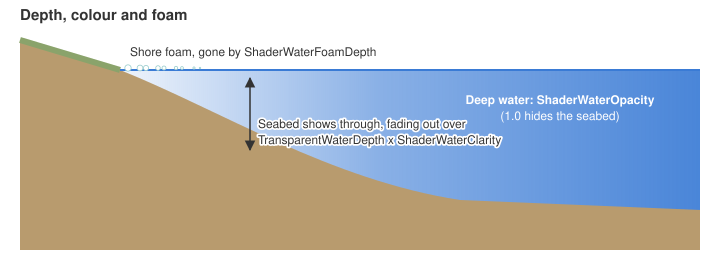
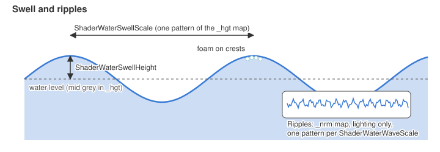
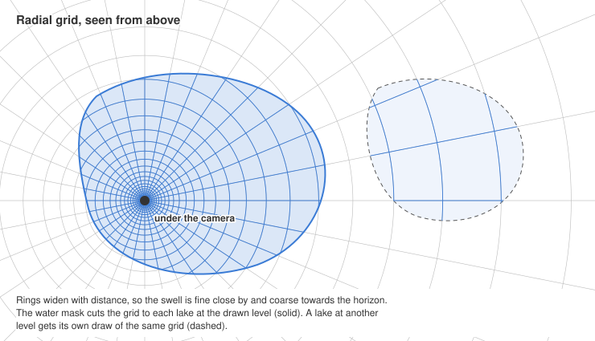
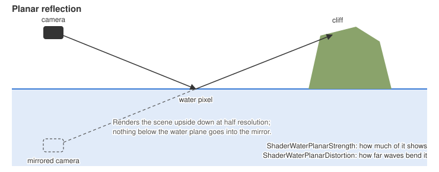

# Water

Lakes, seas and rivers are shaded per pixel. The seabed ripples through the waves and fades into
the water colour with depth, the surface mirrors the cliffs, trees, units and buildings around it
against the map's skybox, the sun glints off the waves, and foam gathers along the shore and on swell
crests. Unit, building and cliff shadows darken the water when shadow mapping is on. Needs the
Direct3D 9 build and shader model 2.0a; other cards get the old water.

Shader model 3 cards draw the full look. The water texture's pattern gives way to a flat colour
that deepens with depth, four layers of waves light that colour and bend the seabed, and small sun
sparkles twinkle over the waves beside the broad glint. `ShaderWaterTexturePattern` brings the
texture's pattern back. Shader model 2.0a cards keep the water texture and two wave layers.

# Options.ini

* `ShowSoftWaterEdge = Yes` - (`Smooth water` in the options menu. On picks shader water, off the
old flat water.)
* `WaterReflections = Yes` - (`Water reflections` in the options menu, applied on Accept. No keeps
only the skybox in the water. The mirror draws the scene a second time at half resolution. Needs
`CheckWaterReflections` in `OptionsMenu.wnd` for the menu control.)
* `ShorelineFoam = Yes` - (`Shoreline foam` in the options menu. A band of surf runs along the
waterline, washing up and back out of step along the shore, and breaks into the foam web as the
water deepens. It follows `ShaderWaterFoamStrength`, `ShaderWaterShoreFoamDepth` and
`ShaderWaterShoreFoamSurge` shape it, and `ShaderWaterFoamDepth = 0` turns it off.
Shader model 3 lakes and seas only, not rivers. Needs `CheckShorelineFoam` in `OptionsMenu.wnd` for
the menu control.)

# Water.ini

The water colour and texture still come from `StandingWaterColor`, `StandingWaterTexture` and the
time of day `DiffuseColor`. On shader model 3 cards the texture gives only its average colour, and
`ShaderWaterDeepColor` can replace that. Tuned in the `WaterTransparency` block of `Water.ini`, and
per map in `map.ini`. WorldBuilder Qt edits a map's keys live under File > Map.ini > Water tuning.

Cheat builds reload `Data\INI\Water.ini` about half a second after it is saved, so the water can be
tuned with a map running. The saved values win over the map's `map.ini` until the map loads again.
A deleted key keeps its value until a restart, skybox textures need a restart, and a file with an
error is skipped until the next save.

## Main keys

These set the look of most maps. The rest are under [Advanced keys](#advanced-keys).

* `ShaderWaterOpacity = 0.95` - (Opacity of deep water. 1 hides the seabed.)
* `ShaderWaterClarity = 1.0` - (How deep the seabed shows. Higher sees deeper.)
* `ShaderWaterDeepColor` - (Colour of deep water, as `R:0-255 G:0-255 B:0-255`. Unset takes the
average colour of `StandingWaterTexture`. The map's light and `DiffuseColor` still tint it. Shader
model 3 only.)
* `ShaderWaterWaveScale = 160` - (World units one wave pattern covers. Higher gives broader waves.)
* `ShaderWaterWaveStrength = 0.3` - (Steepness of the waves. Drives glint, sparkles, reflection and
bending.)
* `ShaderWaterSpecular = 1.0` - (Brightness of the broad sun glint. 0 turns it off.)
* `ShaderWaterSparkle = 2.0` - (Brightness of the small sun specks, times the map's light, sun and
ambient together. 0 turns them off. The specks are a narrow highlight off the ripples, from a sun
ahead of the camera, so they show from every view. More of them show as `ShaderWaterWaveStrength`
rises. Shader model 3 only.)
* `ShaderWaterReflection = 3.0` - (Scales the sky reflection. 0 turns it off.)
* `ShaderWaterSwellHeight = 3.0` - (Height of the vertex waves that lift lakes and seas, in world
units. 0 turns them off. Needs a shader model 3 card.)
* `ShaderWaterFoamStrength = 0.5` - (Brightness of the foam. 1 is full white web, 0 turns foam off.)
* `ShaderWaterAutoMeasure = Yes` - (Calms water by its distance from shore, so ponds, harbours and
rivers are calmer than open sea. See [Open water](#open-water).)
* `ShaderWaterEnclosedCalm = 1.0` - (How much calmer enclosed water is, 0 to 1. At 1 it keeps 40% of
the wave strength, half the broad waves and 20% of the swell.)
* `ShaderWaterZoomCompensation = Yes` - (Keeps the ripples and sun specks as they look up close at any
zoom and camera pitch. Zoomed out, the ripples double in size each time a pixel covers twice the
ground, so their detail never filters away, and the specks glint off a sun just below the view's
own height. No keeps the ripples at `ShaderWaterWaveScale` and the specks off the map sun's height.
Shader model 3 only.)

## Advanced keys

### Depth and colour

* `TransparentWaterDepth = 3.0` - (Depth over which the seabed fades out, and over which the
reflection, glint and foam fade in from the shoreline, so the water meets the ground without a
line. 0 gives a hard shore edge. `ShaderWaterClarity` scales it. Same key as the old water.)
* `TransparentWaterMinOpacity = 1.0` - (Opacity of deep water for the old water, and for shader
water when `ShaderWaterOpacity` is 0.)
* `ShaderWaterTexturePattern = 0` - (How much of `StandingWaterTexture`'s pattern shows over the water
colour, 0 to 1. The pattern keeps `ShaderWaterDeepColor` as its average. 1 with no deep colour set,
`ShaderWaterWaveShading = 0` and `ShaderWaterSparkle = 0` gives the shader model 2.0a look with the
four wave layers. Shader model 3 only.)
* `ShaderWaterFoamDepth = 6` - (Depth where shore foam fades out. 0 turns foam off, crest foam
included. Pier walls, jetties and cliffs rising out of deep water gather foam within 15 world units.)
* `ShaderWaterShoreFoamDepth = 2.0` - (Depth the shoreline foam band reaches at the top of its surge.
Gentle shores show the band wider than steep ones. Needs `ShorelineFoam` in Options.ini. Shader model
3 only.)
* `ShaderWaterShoreFoamSurge = 0.4` - (Share of the shoreline foam band the surge pulls back, 0 to 0.9.
0 holds the band still.)

### Surface

These keys control the glint and how far the waves bend the seabed. The inset in the swell picture
below shows the ripple pattern.

* `ShaderWaterSpecularSpread = 1.0` - (Widens the sun glint. The glint is the sun's reflection, so it
only shows when the camera looks toward the sun, and most maps light from behind the default view.
A wider glint catches more view angles and turns from a sharp sparkle into a broad sheen. Raise
`ShaderWaterSpecular` with it to keep the glint bright.)
* `ShaderWaterVirtualSun = No` - (Yes glints off a sun placed ahead of the camera at the map sun's
height, so the glint shows from every view. The glint then turns with the camera and no longer
matches the direction of shadows and lighting. Only the glint moves.)
* `ShaderWaterRefraction = 0.015` - (How far the waves bend the seabed, as a fraction of the screen.)
* `ShaderWaterWaveShading = 1.0` - (How much the waves light and shade the water's own colour, so
they show from straight above where the reflection is weak. 0 leaves the colour flat. Shader model 3
only.)

On shader model 3 cards the waves come in four layers, from swells over two and a half ripple
patterns wide down to chop a sixth of one, each drifting its own way.

### Open water

Waves grow with the open water the wind crosses, so ponds lie glassy, harbours stay small and
choppy, and open sea rolls. With `ShaderWaterAutoMeasure` the game measures every map cell's
distance to dry ground and calms the water near shore by `ShaderWaterEnclosedCalm`. The other keys
set the open sea's look. Rivers count as enclosed. The distances are measured again when scripts
raise or lower water or the terrain changes. Shader model 3 only, and the distance reading needs
vertex texture support.

* `ShaderWaterOpenReach = 400` - (World units from shore at which water counts as fully open. The
enclosed look fades into the open look over this distance. Distances stop at 2550.)

### Tiling

The ripples and the foam repeat on a fixed grid, which shows as a pattern across a large lake or
sea. Stochastic texturing hides it. The water is split into hex cells, each cell shifts and turns
the patterns by its own random amount, and every point blends the three nearest cells while keeping
the patterns' contrast. The waves travel the same way in every cell.

* `ShaderWaterStochasticSize = 100` - (World units between neighbouring cells. Smaller breaks the
pattern up more but blends more of the surface. 0 turns it off.)
* `ShaderWaterStochasticSeabed = Yes` - (The same cells also shift and turn the terrain textures under
standing water, fading in below the waterline over `TransparentWaterDepth`. Cliffs keep their own
texturing, and ground under rivers is left as it is. Terrain chunks with standing water draw through
their own shaders, which take three point lights instead of eight. No turns it off. The same tiling can
be painted onto dry ground; see [Stochastic terrain](dx9feat.md#stochastic-terrain).)

### Animation

* `WaterAnimationFps = 30` - (Moves the water as if the game ran at this rate, 30 to 60. 30 gives the
original speed. 0 moves the water every frame, so it speeds up with the frame rate when the game
logic is uncapped.)

### Swell

* `ShaderWaterSwellScale = 700` - (World units one swell pattern covers. Higher gives longer swells.)
* `ShaderWaterSwellSpeed = 30` - (World units a second the swell drifts. 0 holds it still.)

The waves reach full height in water twice `ShaderWaterSwellHeight` deep and flatten towards the
shore, so their troughs never sink below the seabed. The swell rides nested square grids centred
under the camera, each with cells twice the size of the one inside it, so it is fine close by and
coarser towards the horizon. Each grid snaps to its own world lattice, so moving the camera never
makes the waves shift or shimmer. The grids cover every flat lake and sea at a level, cut to their
outlines per map cell and one cell wider, so the cut falls on dry land and the shore fades as drawn.
Standing water whose points differ in height by more than a unit keeps its own grid, and rivers stay
flat.

### Reflection

* `ShaderWaterClearReflections = Yes` - (Unit, building and cliff shadows leave the sky and mirrored
scene in the water as bright as around them, as a shadow takes only the sun's light away. They still
darken the water's own colour and hide the glint and specks. No dims the reflections in shadow too.
Shader model 3 only.)
* `ShaderWaterSoftShadows = Yes` - (Shadows in the water blur with depth, up to 4 world units, and
sway with the ripples, as sunlight scatters through the water. No keeps them as sharp as on the
ground. Shader model 3 only.)

* `ShaderWaterPlanarStrength = 0.3` - (Reflection the mirrored scene adds on top of the sky's. 0
leaves the mirror only at grazing angles. Water at another height than the one under the view fades
to the skybox over 4 world units.)
* `ShaderWaterPlanarDistortion = 0.02` - (How far the waves bend the mirrored scene, as a fraction of
the screen. It follows the wave slopes, so `ShaderWaterWaveStrength` and calmer enclosed water scale
it too. 0 keeps the mirror sharp.)

### Retired keys

These keys still load but do nothing, as the water uses fixed values for them:
`ShaderWaterShallowColor`, `ShaderWaterSparkleSize`, `ShaderWaterSparkleSpread`,
`ShaderWaterEnclosedWaves`, `ShaderWaterEnclosedWaveScale`, `ShaderWaterEnclosedSwell`,
`ShaderWaterEnclosedColor`, `ShaderWaterStochasticSharpness`, `ShaderWaterStochasticRandom`,
`ShaderWaterStochasticRotation`, `ShaderWaterFoamReach`, `ShaderWaterFoamScale` and
`ShaderWaterPlanarFade`.

# Key reference

Every key `Water.ini` accepts, with its format, default and useful values. Colours are written
`R:0-255 G:0-255 B:0-255`, with ` A:0-255` added for RGBA. Booleans are `Yes` or `No`. Textures are
file names in `Art\Textures`.

The game enforces only the limits marked **(hard)**, clamping values past them. The other ranges
are where the water still looks right; values outside them load, but the look breaks down.

## WaterTransparency

One block. `map.ini` can override any of these keys for its map.

### Main keys

| Key | Format | Default | Range | Values |
|---|---|---|---|---|
| `StandingWaterColor` | RGB | `R:255 G:255 B:255` | `0` - `255` each **(hard)** | White tints lakes and rivers by the map's light times the `WaterSet` `DiffuseColor`. Black draws them unlit. Any other colour is used as the tint. |
| `ShaderWaterOpacity` | number | `0.95` | `0` - `1` | Opacity of deep water. `0` uses `TransparentWaterMinOpacity`. Above `1` over-brightens. |
| `ShaderWaterClarity` | number | `1.0` | `0.1` - `10` | Scales `TransparentWaterDepth` for how deep the seabed shows. |
| `ShaderWaterDeepColor` | RGB | unset | `0` - `255` each **(hard)** | Colour of deep water. Unset takes the average colour of `StandingWaterTexture`. Shader model 3 only. |
| `ShaderWaterWaveScale` | number | `160` | `1` **(hard)** - `2000` | World units one ripple pattern covers. Below `50` the ripples shimmer, above `2000` they are too broad to see. |
| `ShaderWaterWaveStrength` | number | `0.3` | `0` - `2` | Ripple steepness. `0` is flat. Above `2` the surface turns to glitter. |
| `ShaderWaterSpecular` | number | `1.0` | `0` - `5` | `0` turns the sun glint off. Above `5` the glint washes out to white. |
| `ShaderWaterSparkle` | number | `2.0` | `0` **(hard)** - `10` | Brightness of the small sun sparkles. `0` turns them off. Shader model 3 only. |
| `ShaderWaterReflection` | number | `3.0` | `0` - `10` | `0` turns the sky reflection off. Reflection is capped at 80% **(hard)**, so higher values only spread that cap to steeper views. |
| `ShaderWaterSwellHeight` | number | `3.0` | `0` - `10` | Height of the vertex waves in world units. `0` turns them off. Waves shrink in water shallower than twice this. Above `10` they cut into hulls. |
| `ShaderWaterFoamStrength` | number | `0.5` | `0` **(hard)** - `2` | Brightness of the foam. `0` turns it off. |
| `ShaderWaterAutoMeasure` | Yes/No | `Yes` | - | Calms water by its distance from shore. `No` gives all water the open look. Shader model 3 only. |
| `ShaderWaterEnclosedCalm` | number | `1.0` | `0` - `1` **(hard)** | How much calmer enclosed water is. `0` gives it the open look. |
| `ShaderWaterZoomCompensation` | Yes/No | `Yes` | - | Keeps the ripples and sun specks as they look up close at any zoom and camera pitch. Shader model 3 only. |

### Advanced keys

| Key | Format | Default | Range | Values |
|---|---|---|---|---|
| `TransparentWaterDepth` | number | `3.0` | `0` - `50` | Depth over which the seabed fades out and the surface fades in from the shore. `0` gives a hard shore edge. |
| `TransparentWaterMinOpacity` | number | `1.0` | `0` - `1` | Opacity of deep water for the old water, and for shader water when `ShaderWaterOpacity` is `0`. Above `1` over-brightens. |
| `StandingWaterTexture` | texture | `TWWater01.tga` | - | Surface texture of lakes, seas and rivers. Its `_nrm.dds` and `_hgt.dds` follow its name. |
| `AdditiveBlending` | Yes/No | `No` | - | `Yes` adds the water onto the scene and keeps the old water, with no shader water. |
| `IsWater` | Yes/No | `Yes` | - | `No` draws the map's water as the old water, with no shader water, for lava and other liquids that should not reflect, refract or foam. |
| `RadarWaterColor` | RGB | `R:140 G:140 B:255` | `0` - `255` each **(hard)** | Colour of water on the radar. |
| `SkyboxTextureN` | texture | `TSMorningN.tga` | - | North face of the skybox, which shader water reflects. Also `SkyboxTextureE`, `S`, `W` and `T` (top), defaulting to `TSMorningE.tga` and so on. |
| `ShaderWaterTexturePattern` | number | `0` | `0` - `1` **(hard)** | How much of the water texture's pattern shows over the water colour. `0` is the plain colour, `1` the full pattern. Shader model 3 only. |
| `ShaderWaterFoamDepth` | number | `6` | `0` - `30` | Depth where shore foam fades out. `0` turns foam off, crest foam included. |
| `ShaderWaterShoreFoamDepth` | number | `2.0` | `0.1` **(hard)** - `10` | Depth the shoreline foam band reaches at the top of its surge. Shader model 3 only. |
| `ShaderWaterShoreFoamSurge` | number | `0.4` | `0` - `0.9` **(hard)** | Share of the shoreline foam band the surge pulls back. `0` holds it still. |
| `ShaderWaterSpecularSpread` | number | `1.0` | `0.1` **(hard)** - `16` | Widens the sun glint so it shows at more view angles. Below `1` it narrows. Above `16` the glint turns into a haze over the whole surface. |
| `ShaderWaterVirtualSun` | Yes/No | `No` | - | `Yes` glints off a sun ahead of the camera at the map sun's height, so the glint shows from every view. |
| `ShaderWaterRefraction` | number | `0.015` | `0` - `0.1` | Fraction of the screen the waves bend the seabed by. `0` turns it off. Above `0.05` smears. |
| `ShaderWaterWaveShading` | number | `1.0` | `0` **(hard)** - `3` | How much the waves light and shade the water's colour. `0` leaves it flat. Shader model 3 only. |
| `ShaderWaterOpenReach` | number | `400` | `1` **(hard)** - `2550` | World units from shore at which water counts as open. Distances past `2550` count as `2550`. |
| `ShaderWaterStochasticSize` | number | `100` | `0`, or `30` - `1000` | World units between the cells that shift the patterns to hide their tiling. `0` turns it off. Below `30` the patterns blur, above `1000` the pattern shows within a cell. |
| `ShaderWaterStochasticSeabed` | Yes/No | `Yes` | - | `Yes` also hex-tiles the terrain under standing water. Needs pixel shader 2.0a. |
| `ShaderWaterSwellScale` | number | `700` | `1` **(hard)** - `3000` | World units one swell pattern covers. Below `200` the swell looks choppy, above `3000` it is too broad to see. |
| `ShaderWaterSwellSpeed` | number | `30` | `-200` - `200` | World units a second the swell drifts. `0` holds it still. Negative reverses it. |
| `ShaderWaterPlanarStrength` | number | `0.3` | `0` - `1` | Reflection the mirrored scene adds on top of the sky's. The 80% cap applies to the sum. |
| `ShaderWaterPlanarDistortion` | number | `0.02` | `0` - `0.1` | Fraction of the screen the waves bend the mirrored scene by. `0` keeps it sharp. |
| `ShaderWaterClearReflections` | Yes/No | `Yes` | - | Shadows leave the reflections as bright as around them. Shader model 3 only. |
| `ShaderWaterSoftShadows` | Yes/No | `Yes` | - | Shadows in the water blur with depth and sway with the ripples. Shader model 3 only. |
| `WaterAnimationFps` | whole number | `30` | `0`, or `30` - `60` **(hard)** | Moves the water as if the game ran at that rate. `0` moves it every frame. Values from `1` to `29` count as `30`, and above `60` as `60`. |

## WaterSet

One block per time of day: `WaterSet MORNING`, `AFTERNOON`, `EVENING` and `NIGHT`. Only
`DiffuseColor` touches the lakes, seas and rivers above. The rest drive the old mirrored water
types and the animated water grid, which shader water does not use.

| Key | Format | Default | Range | Values |
|---|---|---|---|---|
| `DiffuseColor` | RGBA | `R:0 G:0 B:0 A:0` | `0` - `255` each **(hard)** | Tint of lakes and rivers when `StandingWaterColor` is white. Alpha is the old water's opacity. |
| `TransparentDiffuseColor` | RGBA | `R:0 G:0 B:0 A:0` | `0` - `255` each **(hard)** | Colour and alpha of the old pixel shader sea. |
| `SkyTexture` | texture | none | - | Sky plane the old mirrored water reflects. |
| `SkyTexelsPerUnit` | number | `0` | `0.1` - `10` | Sky texture texels per world unit. Higher repeats the texture more. |
| `UScrollPerMS` | number | `0` | `-0.1` - `0.1` | Sky plane drift along one axis, in world units a millisecond. |
| `VScrollPerMS` | number | `0` | `-0.1` - `0.1` | Sky plane drift along the other axis, in world units a millisecond. |
| `Vertex00Color` | RGBA | `R:0 G:0 B:0 A:0` | `0` - `255` each **(hard)** | Colour at one corner of the sky plane. Also `Vertex01Color`, `Vertex10Color` and `Vertex11Color` for the other three. |
| `WaterTexture` | texture | none | - | Texture of the animated water grid. |
| `WaterRepeatCount` | whole number | `0` | `1` - `100` | Times `WaterTexture` repeats across the water grid. |

# Textures

All sit in `Art\Textures` itself, not in a subfolder.

* `TWWater01_nrm.dds` for `TWWater01.tga` - (Normal map that replaces the built-in waves, named like
unit normal maps. It tiles every `ShaderWaterWaveScale` units, in the DirectX convention. DXT
compressed with mipmaps; the game reads no other DDS layout.)
* `TWWater01_hgt.dds` - (Swell heights, greyscale DXT with mipmaps, mid grey is the resting level.
The height is read from alpha in a DXT5 file whose alpha varies, and from green otherwise. Without
it the swell uses the built-in waves.)

* `WaterFoam.dds` - (Foam for every water texture, replacing the built-in cell web. Greyscale, read
from red, bright where foam is dense; a tiling DXT with mipmaps. One pattern covers 150 world units up
close. `TWWater01_foam.dds` beside a water texture overrides it for that texture alone.)

`scripts/water_maps.py` builds the normal and swell textures from any image (needs Python with numpy
and Pillow).

# Notes

* Many maps pick their own `StandingWaterTexture` in `map.ini`, such as `twwater01trop.tga` on
tropical maps, `twwater01ice.tga` on winter maps and `twlava.tga` for lava. To change such a map's
water, replace that texture; its `_nrm.dds` and `_hgt.dds` follow its name.
* The sky in the reflection is the map's skybox (`SkyboxTexture*` in `WaterTransparency`), dimmed by
the map's lighting.
* One water height is mirrored at a time, that of the flat water under the middle of the view. Water
at other heights and sloping rivers show the skybox alone, as does a camera looking nearly level.
* Particles, decals and shadows are left out of the reflection, and only objects near the view are
mirrored.
* Objects standing in or over the water are kept out of the refraction, so hulls and props don't
smear into the waves.
* Effects drawn after the water (smoke, fire, translucent models) are not bent by the waves.
* `AdditiveBlending = Yes` water keeps the old look.
* Lava maps should set `IsWater = No` in the `WaterTransparency` block of their `map.ini`, so the
lava keeps the old look instead of reflecting the sky and gathering foam. The next map gets shader
water back.
* The `CONTRA_WATER` environment variable picks the water: `0` the old water, `1` pixel shader 2.0a
water, `2` shader model 3 water with vertex waves on each water area's own grid, `3` (the default)
with them on the grids around the camera.
